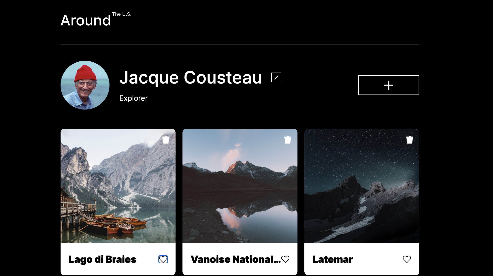
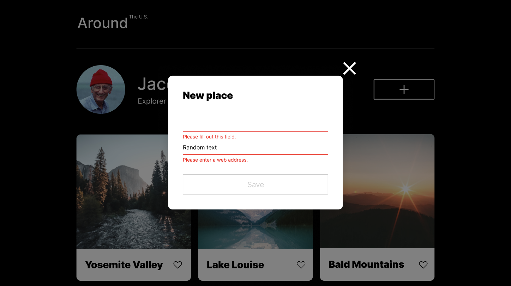

# Practicum Project 3 - 7: Around The U.S.

This is a project from Practicum of the Web Development program. It was created using HTML, CSS and JavaScript based on the Figma design layout. The web page is responsive, so it has been designed for both desktop and mobile devices. Photos have been optimized using "TinyPng" (https://tinypng.com/). The new interacitve functions introduced during project 4 + 5, the users are able to add/remove new photos and new text as well as changing the users profile. In Project 6 Event Handling was introduced which inlcudes the validation (warning message) during an entry in the fields. Project 7 focused on object-oriented programming that covers encapsulation, inheritance and polymorphism.

## Pictures

## Figma

- [Link to the project on Figma](https://www.figma.com/file/ii4xxsJ0ghevUOcssTlHZv/Sprint-3%3A-Around-the-US?node-id=0%3A1)

## Project Features

- HTML5
- CSS
- JavaScript
- Flexbox
- Grid Layout
- Use of media queries for all elements to display properly on different screen resolutions
- BEM
- Use of psuedo-classes to for hover over functions
- Event Handling
- Form Validation
- Object-oriented Programming (Encapsulation, Inheritance, Polymorphism)

## Plan on improving the project

- Implemeting advanced object-oriented programming by destructuring the syntax and building the project with a Webpack.

# GitHub Page

- [Link to the Github Page](https://mzlatunic35.github.io/se_project_aroundtheus/)
